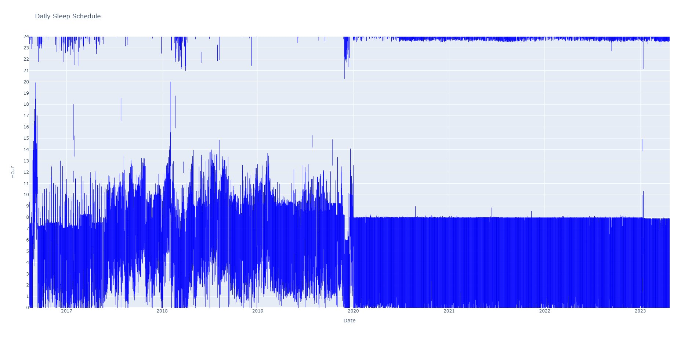

# fitbit-data-parser
Parses and plots some fitbit exported data, which you can get by logging into http://www.fitbit.com, going to settings, data export.  

Plots daily sleep schedule charts, like this:  

Also plots daily step counts.
